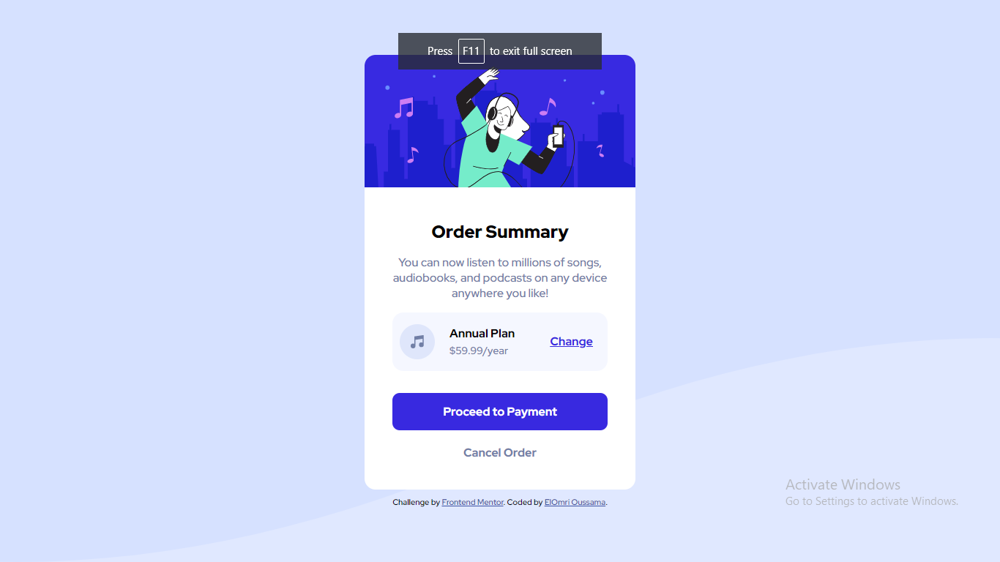

# Frontend Mentor - Order summary card solution

This is a solution to the [Order summary card challenge on Frontend Mentor](https://www.frontendmentor.io/challenges/order-summary-component-QlPmajDUj). Frontend Mentor challenges help me improve my coding skills by building realistic projects. 

## Table of contents

- [Overview](#overview)
  - [Screenshot](#screenshot)
  - [Links](#links)
- [My process](#my-process)
  - [Built with](#built-with)
  - [Continued development](#continued-development)
- [Author](#author)
- [Acknowledgments](#acknowledgments)

**Note: Delete this note and update the table of contents based on what sections you keep.**

## Overview

### Screenshot

### Links

- Solution URL: [Github](https://github.com/oussamaelomri/ordersummary.github.io)
- Live Site URL: [Live](https://your-live-site-url.com)

## My process

### Built with

- Semantic HTML5 markup
- CSS custom properties
- Flexbox

### Continued development

In the option plan, in the in god willing, I want to replace the option plan with a dropdown button which it give a lot of options with the same style of .option

## Author

- Frontend Mentor - [@ElOmriOussama](https://www.frontendmentor.io/profile/oussamaelomri)

## Acknowledgments

If you have a best idea of change the option plan or any thing you are free to add everything you want.
Thank you.
